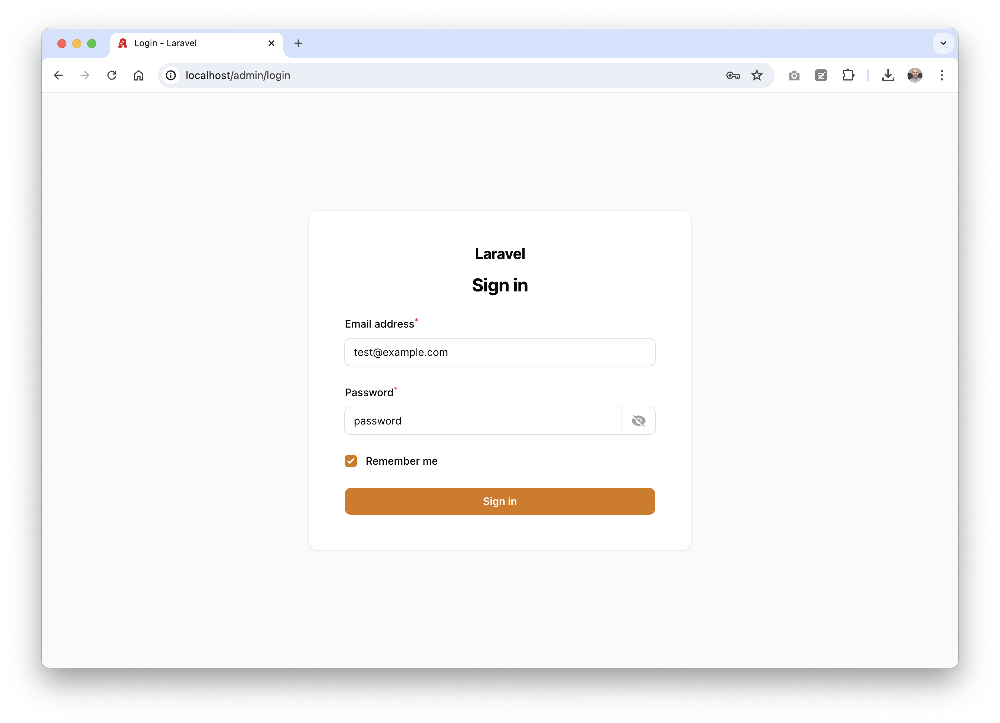
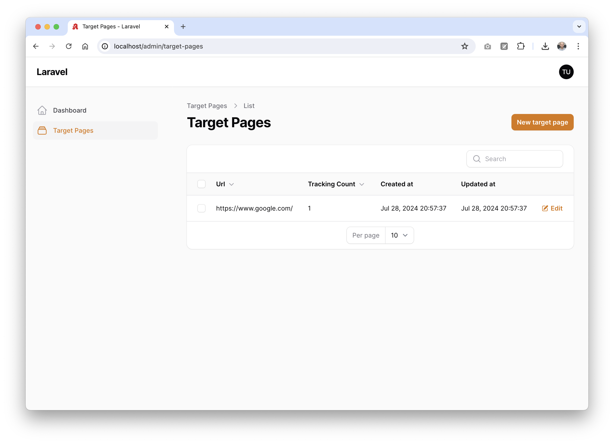
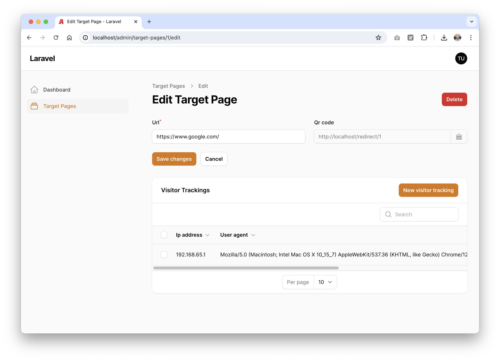
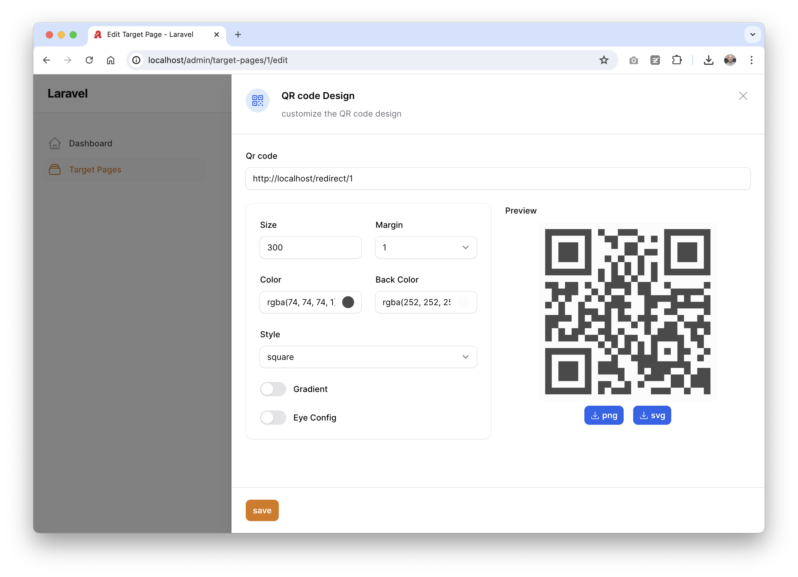

# QR Code Generator and link tracking

Simple QR Code Generator and link tracking tool based on Laravel, Filament and Lara Zeus QR code plugin for Filament.

## Installation

### First time installation

`docker run --rm --pull=always -v "$(pwd)":/opt -w /opt laravelsail/php83-composer:latest bash -c "composer install --ignore-platform-reqs"`

### Laravel Sail

Run:
- `cp .env.example .env`
- `sail up -d`
- `sail artisan key:generate`
- `sail artisan migrate:fresh --seed`

### Open Filament Admin Panel

Go to [http://localhost/admin/login](http://localhost/admin/login) and use the default credentials from the DatabaseSeeder:

```
User: test@example.com
Pass: password
```


### Create a new target page

- Go to [Target Pages](http://localhost/admin/target-pages)



- Click on [New target page](http://localhost/admin/target-pages/create):




- Save new target page
- Check the QR Code (click icon next to the Qr code input field)



### Open the redirect page

- Open [http://localhost/redirect/1](http://localhost/redirect/1)
- You're being redirected to the target page
- Check the counter increase in Filament Admin Panel